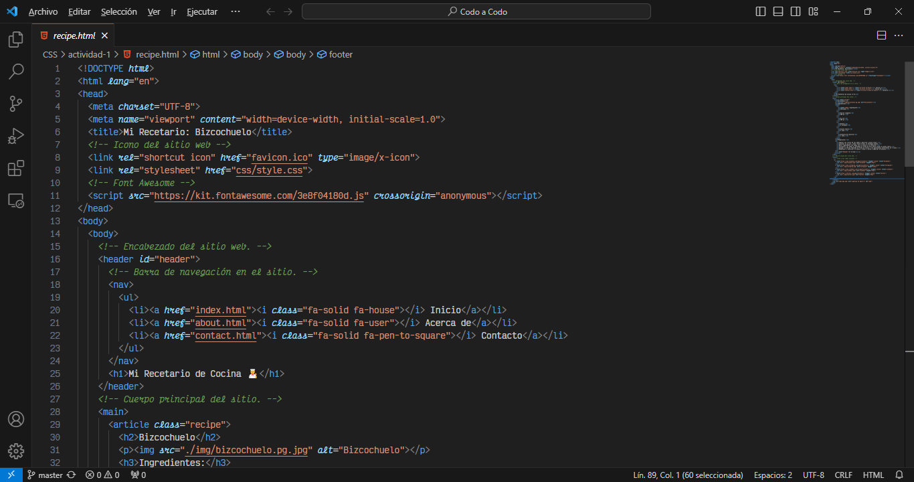
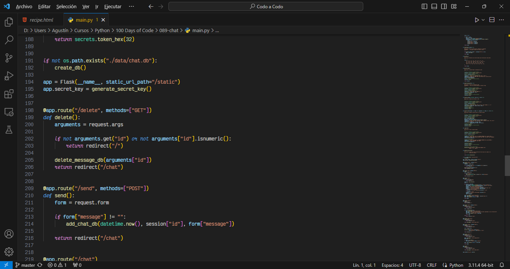

# My Modern Dark Theme para Visual Studio Code


Mi Tema Oscuro Moderno es un tema personalizado para Visual Studio Code, basado en el popular tema Modern Dark. Ha sido modificado para incluir fuentes en cursiva y está optimizado para su uso con la fuente Victor Mono Nerd.

## Características

- **Estética Moderna Oscura:** Mi Tema Oscuro Moderno se basa en el diseño elegante y moderno del tema Modern Dark, proporcionando una experiencia visualmente agradable mientras codificas.

- **Fuentes en Cursiva:** Este tema incluye fuentes en cursiva para una presentación del código más elegante y distintiva visualmente.

- **Fuente Victor Mono Nerd:** Mi Tema Oscuro Moderno está optimizado para su uso con la fuente Victor Mono Nerd, mejorando la experiencia general de codificación.

## Instalación de la Fuente Victor Mono Nerd

Para obtener la mejor experiencia con este tema, recomendamos instalar la fuente Victor Mono Nerd. Sigue estos pasos:

1. Visita la página de descarga de Nerd Fonts: https://www.nerdfonts.com/font-downloads

2. Busca "Victor Mono" en la página.

3. Haz clic en el botón de descarga junto a Victor Mono.

4. Una vez descargado el archivo, descomprímelo.

5. Instala las fuentes:
   - **Windows:** Selecciona todos los archivos .ttf, haz clic derecho y elige "Instalar".
   - **macOS:** Doble clic en cada archivo .ttf y selecciona "Instalar fuente".
   - **Linux:** Copia los archivos .ttf a `~/.local/share/fonts/` y ejecuta `fc-cache -f -v` en la terminal.

6. Reinicia Visual Studio Code después de instalar las fuentes.

## Instalación del Tema

1. Abre Visual Studio Code.

2. Ve a la vista de Extensiones haciendo clic en el icono cuadrado en la barra lateral izquierda o presionando `Ctrl+Shift+X`.

3. Busca "my-modern-dark-theme".

4. Haz clic en el botón "Instalar" para instalar el tema.

5. Una vez instalado, selecciona el tema en el menú desplegable de Tema de Color en la Paleta de Comandos (`Ctrl+K Ctrl+T`) o haciendo clic en el icono de engranaje en la esquina inferior derecha de la ventana y seleccionando "Tema de Color".

## Capturas de Pantalla





## Personalización

Puedes personalizar aún más el tema modificando tu archivo `settings.json`. Aquí tienes un ejemplo de configuración que puedes usar:

```json
{
  "editor.fontFamily": "'Victor Mono Nerd', 'Victor Mono', monospace",
  "editor.fontSize": 14,
  "editor.fontLigatures": true,
  "editor.tokenColorCustomizations": {
    "textMateRules": [
      {
        "scope": [
          "comment",
          "keyword",
          "variable.language"
        ],
        "settings": {
          "fontStyle": "italic"
        }
      }
    ]
  }
}
```

Esta configuración usa Victor Mono Nerd como fuente principal, con Victor Mono como respaldo y cualquier fuente monoespaciada como última opción. También habilita las ligaduras de fuentes y aplica estilos en cursiva a ciertos elementos del código.

## Créditos
**Tema Modern Dark:** Tema original por Microsoft.

**Fuente Victor Mono:** Victor Mono por Ruben Verborgh.

**Fuente Victor Mono Nerd:** Versión de Victor Mono con parches de Nerd Fonts.

😎